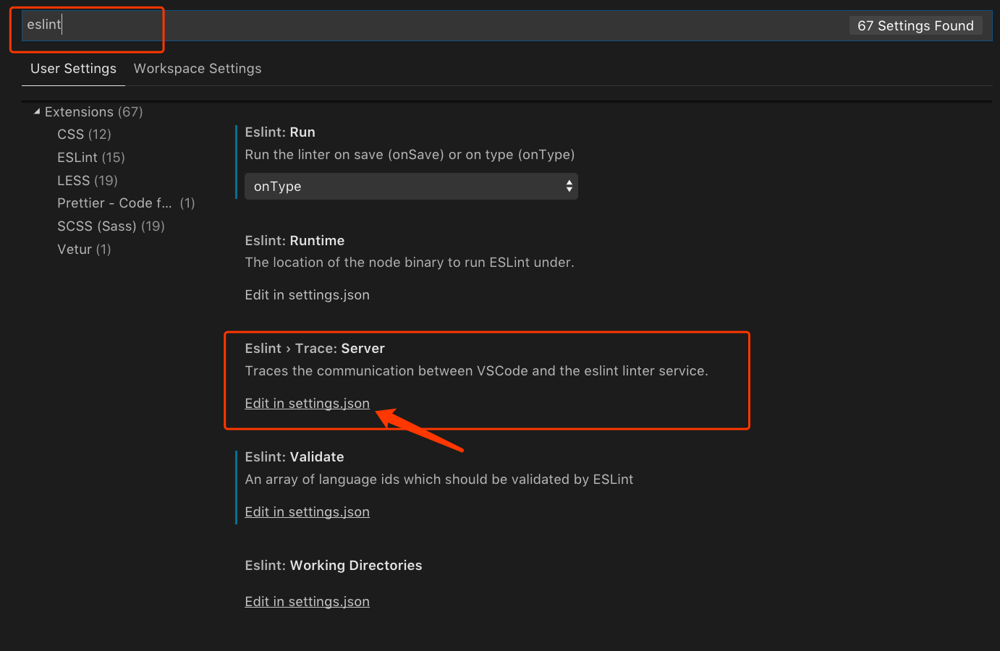
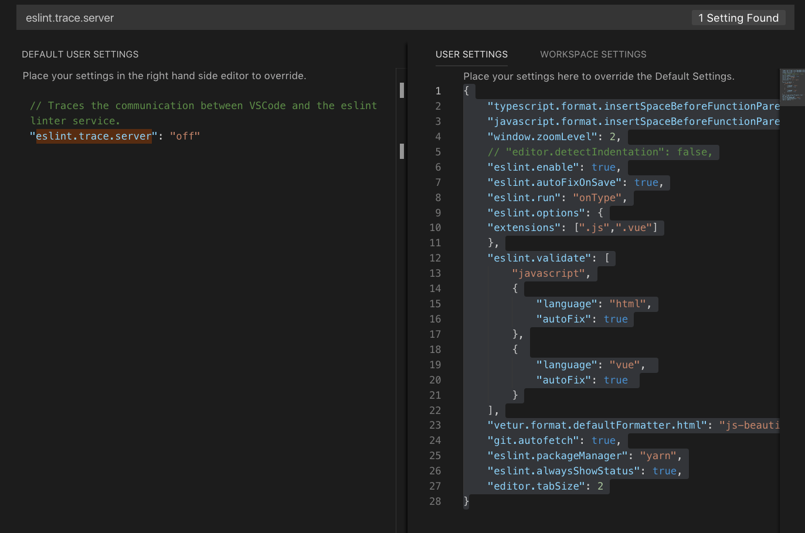

# VSCode 插件配置

#### 安装插件：vetur，eslint，prettier

> 配置eslint规则：
如下图，commond+, 进入vscode配置页，输入eslint，找到Eslint > Trace:Server,点击下方：Edit it setting.json,将如下代码粘贴到配置中，保存即可





```javascript
{
    "typescript.format.insertSpaceBeforeFunctionParenthesis": true,
    "javascript.format.insertSpaceBeforeFunctionParenthesis": true,
    "window.zoomLevel": 2,
    // "editor.detectIndentation": false,
    "eslint.enable": true,
    "eslint.autoFixOnSave": true,
    "eslint.run": "onType",
    "eslint.options": {
        "extensions": [
            ".js",
            ".vue"
        ]
    },
    "eslint.validate": [
        "javascript",
        {
            "language": "html",
            "autoFix": true
        },
        {
            "language": "vue",
            "autoFix": true
        }
    ],
    "vetur.format.defaultFormatter.html": "js-beautify-html",
    "git.autofetch": true,
    "eslint.packageManager": "yarn",
    "eslint.alwaysShowStatus": true,
    "editor.tabSize": 2
}
```
